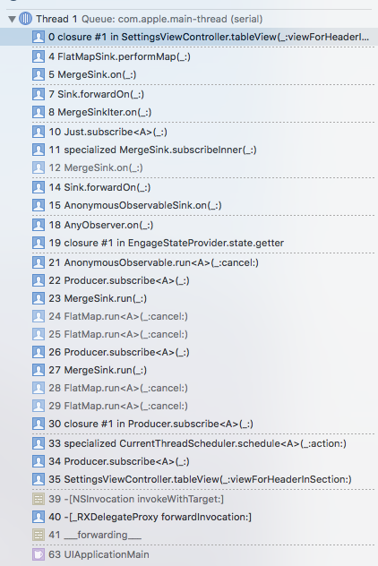

# iOS Tech Gathering `RxSwift`

## What is `RxSwift`

> Rx is a generic abstraction of computation expressed through Observable<Element> interface.
> 
> This is a `Swift` version of `Rx`.
> 
> It tries to port as many concepts from the original version as possible, but some concepts were adapted for more  pleasant and performant integration with iOS/macOS environment.
> 
> Cross platform documentation can be found on ReactiveX.io.
> 
> Like the original Rx, its intention is to enable easy composition of asynchronous operations and event/data streams.
> 
> KVO observing, async operations and streams are all unified under abstraction of sequence. This is the reason why > Rx is so simple, elegant and powerful.

## Why should you use `Rx`

> It enables building apps in a declarative way.

In my opinion, when you're new to the `language` it's not always that clear. But eventually when you get used to it. `RxSwift` becomes a very powerfull framework to use within your application / code.

## Getting Started

### Basics

> The equivalence of observer pattern (`Observable<Element>` sequence) and normal sequences (`Sequence`) is the most important thing to understand about Rx.

> Every `Observable sequence` is just a `sequence`. The key advantage for an `Observable` vs `Swift's Sequence` is that it can also receive elements asynchronously. This is the kernel of `RxSwift`, documentation from here is about ways that we expand on that idea.

Something important to keep in mind is that when a `Sequence` gets an `error` or an `completed` the `sequence` cannot produce any other elements.


```swift

enum Event<Element>  {
    case next(Element)      // next element of a sequence
    case error(Swift.Error) // sequence failed with error
    case completed          // sequence terminated successfully
}

class Observable<Element> {
    func subscribe(_ observer: Observer<Element>) -> Disposable
}

protocol ObserverType {
    func on(_ event: Event<Element>)
}
```

Another important thing to keep in mind is that an `observerd sequence` also can terminate when we release all of the resources allocated to compute upcominging elements. `Dispose` on a description.

`DisposeBag` can be compared with `ARC` behaviour in `Rx`.

> When a DisposeBag is deallocated, it will call dispose on each of the added disposables.

### Implicit `Observable` guarantees

```swift
someObservable
  .subscribe { (e: Event<Element>) in
      print("Event processing started")
      // processing
      print("Event processing ended")
  }
  .disposed(by: disposeBag)
```

### Creating your own Observable

```swift
func myJust<E>(_ element: E) -> Observable<E> {
    return Observable.create { observer in
        observer.on(.next(element))
        observer.on(.completed)
        return Disposables.create()
    }
}

myJust(0)
    .subscribe(onNext: { n in
      print(n)
    })
```

This will print

```
0
```

### Subjects

A Subject is a sort of bridge or proxy that acts both as an observer and as an Observable.A subject can emit it’s elements even it if it has no observers.

```swift
// Ingore all elements that are submitted before `subscribe` happend
let someSubject = PublishSubject<String>()

// Will repeat only the one last value. And it's initiated with a starting value
let anotherSubject = BehaviourSubject<String>(value: "default value")

// Will repeat the last N number of values. Even the ones before the subscription happened
let thirdSubject = ReplaySubject<String>.create(bufferSize: 3)

```

### Variable

`Variable` is just a simple wrapper over `BehaviorSubject`

```swift
let googleString = Variable("currentString")

print(googleString.value)              //Getting the value

googleString.value = "newString"       //Setting the value

googleString
    .asObservable()                    //Observing the value
    .subscribe(onNext: { text in      
        print(text)
    })
    .addDisposableTo(disposeBag)
```

### Operators

There are numerous operators implemented in `RxSwift`.

`Marble diagrams` for all operators can be found on ReactiveX.io or rxmarbles.com

For example: `CombineLatest`


> when an item is emitted by either of two Observables, combine the latest item emitted by each Observable via a specified function and emit items based on the results of this function

```swift
let result = Observable
.combineLatest(SomeObservable, AnotherObservable) { item1, item2 in

    return item1 + item2

}
```

I can't tell you about every operator there is but once you're working with `RxSwift` you'll get in touch with them.

- `FlatMap`
- `Map`
- `CombineLatest`
- `Filter`
- `Throttle`

Were some of the operators we've used the most in our project.

### Debugging

Debugging is `helpfull` that is the least you can say about it. But when working with `Rx` it can be a FPITA. Sorry for my language but this is something I hated the most while using `Rx`. Because when working with `Rx` your stack trace won't be that readable as before. So it might become useless.



But there is a solution.
The `.debug()` will print when a sequence is

- `observed`
- `disposed`
- `called`

which might become very handy while debugging.